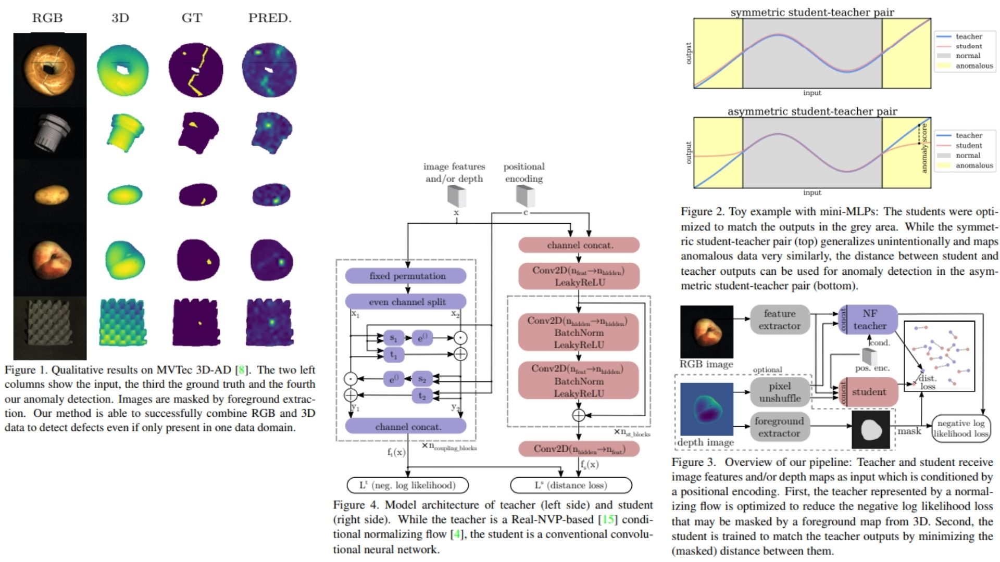

# 📼 AST-Replication — Asymmetric Student-Teacher for Industrial Anomaly Detection

This repository provides a **faithful Python replication** of the **AST framework** for pixel-level anomaly detection in industrial RGB and 3D images.  
The goal is to **reproduce the model, math, and block diagram from the paper** without full-scale training.

Highlights:

* **Pixel-wise anomaly detection** via asymmetric student-teacher distillation 🪐  
* Teacher uses **normalizing flows** for density-aware guidance 🔮  
* Student CNN learns to **match teacher outputs**, triggering high distances for anomalies ✨  
* Anomaly maps $$A$$ and image-level scores $$\max(A)$$ 📊  

Paper reference: *[Asymmetric Student-Teacher Networks for Industrial Anomaly Detection](https://arxiv.org/abs/2210.07829)*  

---

## Overview 🖼️



> The pipeline trains a **student CNN** to regress outputs of a **teacher normalizing flow** on defect-free features.  
> Pixel-level anomalies are detected by computing the **distance** between student and teacher outputs.

Key points:

* **Teacher (ft)**: RealNVP-based normalizing flow, sensitive to anomalies 🌊  
* **Student (fs)**: fully convolutional network with residual blocks ⚡  
* **Input**: feature maps from pretrained backbone, optionally concatenated with 3D depth maps 🏗️  
* **Anomaly map** $$A$$: high values indicate pixel-level deviations  
* **Image-level score**: $$\max(A)$$

---

## Core Math 🧮

**Teacher negative log-likelihood** (RealNVP bijective flow):

$$
L_t = - \log p_X(x_{ij}) = \frac{1}{2} \| z_{ij} \|_2^2 - \log \Big| \det \frac{\partial z_{ij}}{\partial x_{ij}} \Big|
$$

**Student distance loss**:

$$
L_s = \| f_s(x)_{ij} - f_t(x)_{ij} \|_2^2
$$

**Pixel-wise anomaly score**:

$$
A_{ij} = \| f_s(x)_{ij} - f_t(x)_{ij} \|_2
$$

- $$f_t(x)$$ = teacher outputs  
- $$f_s(x)$$ = student outputs  
- $$x$$ = input features (RGB + optional 3D)  

> At test time, **image-level score**: $$\max_{i,j} A_{ij}$$  

---

## Why AST Matters 🌟

* Learns **industrial anomalies** without labeled defects 🏭  
* **Asymmetric architecture** avoids undesired generalization from teacher to student 🛡️  
* Student-teacher distance is a **robust anomaly measure** compared to likelihood alone 💎  
* Modular: backbone, teacher, student, and distance calculation can be replaced or extended 🔧  

---

## Repository Structure 🏗️

```bash
AST-Replication/
├── src/
│   ├── backbone/
│   │   └── feature_extractor.py      # φ(I): image → feature maps (ImageNet pretrained)
│   │
│   ├── layers/
│   │   ├── coupling.py               # affine coupling layer (Eq.1)
│   │   ├── subnet.py                 # s(·), t(·) networks (conv blocks)
│   │   └── positional_encoding.py    # sinusoidal encoding (c)
│   │
│   ├── modules/
│   │   ├── normalizing_flow.py       # Teacher ft (RealNVP, multi coupling blocks)
│   │   └── student_cnn.py            # Student fs (fully conv + residual blocks)
│   │
│   ├── losses/
│   │   └── losses.py                 # Lt (NLL) & Ls (L2 distance)
│   │
│   ├── utils/
│   │   └── anomaly.py                # pixel-wise anomaly score
│   │
│   ├── model/
│   │   └── ast_model.py             
│   │
│   └── config.py                     # hyperparameters, residual blocks, layers, stride
│
├── images/
│   └── figmix.jpg                    
│
│
├── requirements.txt
└── README.md
```

---

## 🔗 Feedback

For questions or feedback, contact:  
[barkin.adiguzel@gmail.com](mailto:barkin.adiguzel@gmail.com)
